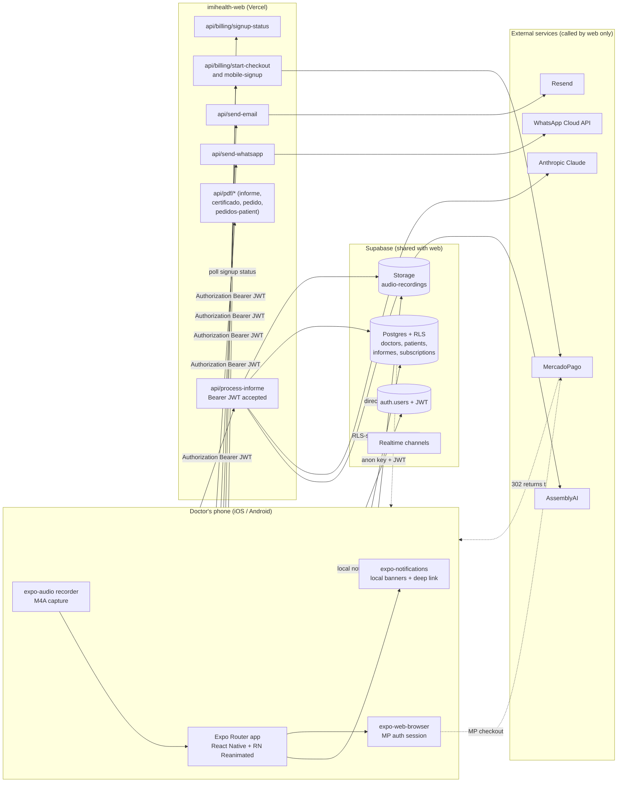
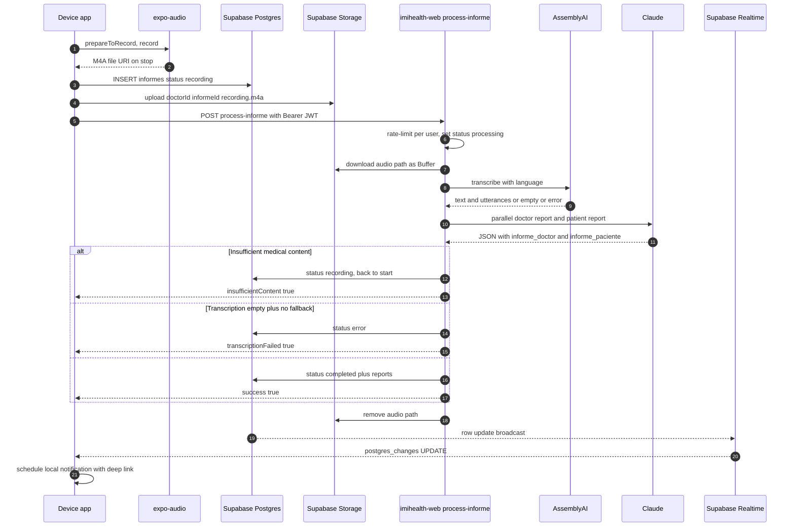
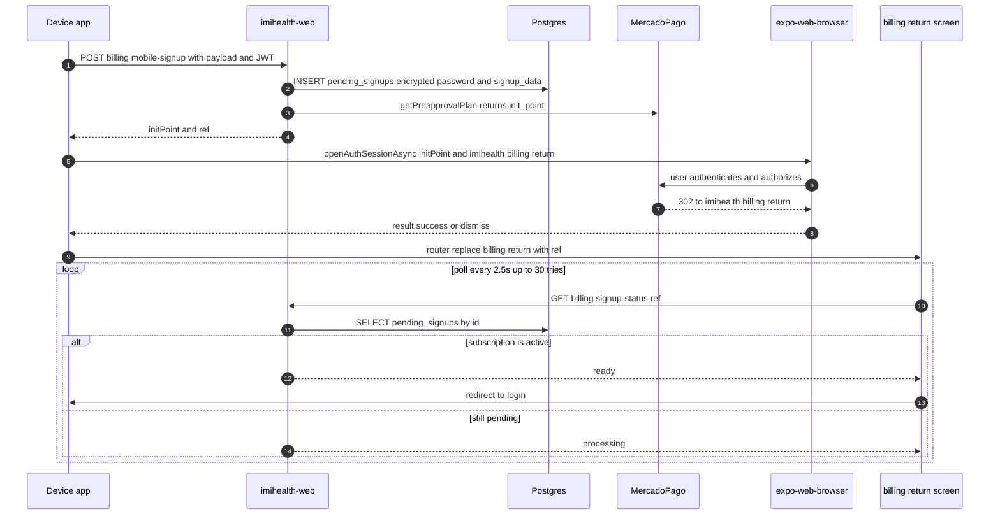

# IMI Health — Mobile (Expo)

Native iOS / Android companion to the `imihealth-web` Next.js app. A physician records a consultation from their phone; the audio is uploaded to Supabase Storage and processed by the existing web backend — AssemblyAI transcribes (with diarization), Claude produces a structured clinical note (doctor-facing) plus a plain-language summary (patient-facing), and the doctor distributes the resulting PDFs via WhatsApp, e-mail, or the native share sheet. Pro subscriptions are sold through MercadoPago via an authenticated in-app browser session.

The mobile app is **a thin client over the web backend**. It owns the recording experience, the native UI, native auth/session, and the share/print integrations — every operation that needs a server secret (AssemblyAI, Anthropic, MercadoPago, WhatsApp Cloud API, Resend, PDF rendering) is delegated to the `imihealth-web` API routes, authenticated with a Supabase JWT bearer token.

This document is the entry point for the codebase: what the app does, how it is built, and why the moving parts fit together the way they do.

---

## 1. Product surface

| Capability | What the doctor sees | What happens under the hood |
|---|---|---|
| **Classic informe** | Pick a patient from the native list, tap record, talk through the consultation, stop. A doctor report + patient report appear on the patient timeline. | `expo-audio` captures M4A → uploaded straight to Supabase Storage → `POST /api/process-informe` on the web backend → AssemblyAI + Claude → DB. |
| **Informe rápido** | One-tap record without choosing a patient. A doctor-only note is produced and saved. | Same pipeline, `patient_id` is `null`. |
| **Pedidos** (medical orders) | Inside an informe, the doctor selects ordered studies and the app produces one PDF per item. | Web backend renders with `pdf-lib`; mobile downloads via `expo-file-system` and hands off to `expo-sharing`. |
| **Certificado** | Generates a sick-leave / medical certificate with N days off, diagnosis and observations. | Same PDF pipeline; sanitized labels and signature image embedded server-side. |
| **WYSIWYG editing** | Markdown editor (`react-native-markdown-display` + custom editor) for both the doctor and patient versions. | Patches written back through the Supabase client (RLS-scoped); PDFs are regenerated on demand. |
| **Distribution** | Send to patient by WhatsApp or e-mail; alternatively share via the OS share sheet. | `POST /api/send-whatsapp` and `POST /api/send-email` on the web backend; share sheet uses `expo-sharing`. |
| **Dashboard** | Counts, status breakdown, and per-month volume — same charts as web, native render. | Aggregated client-side from Supabase reads; rendered with `react-native-gifted-charts`. |
| **Push notifications** | A processing informe finishes → the doctor's phone shows a banner; tapping it deep-links to the informe. | Realtime subscription on `informes` table → `expo-notifications` local scheduled notification. |
| **Pro signup & upgrade** | Signup form → MercadoPago opens in an in-app browser → returns to a polling screen → "Account ready". | Deep link `imihealth://billing/return` + polled `/api/billing/signup-status` on the web backend. |

---

## 2. Tech stack

### Runtime
- **Expo SDK 54** with the **New Architecture** enabled (`app.json:newArchEnabled: true`) and the **React Compiler** experiment turned on (`app.json:experiments.reactCompiler`), so most components avoid manual `useMemo`/`useCallback`.
- **Expo Router 6** — file-based routing with grouped layouts (`(app)`, `(auth)`), a native bottom-tab navigator, and deep-link routes for auth/billing returns (`scheme: "imihealth"`).
- **React 19** + **React Native 0.81** (Hermes).
- **TypeScript 5.9**, **Zod 4** for runtime validation on every form and every API boundary.
- **react-hook-form** + **@hookform/resolvers** for form state.
- **i18next** + **react-i18next** + **expo-localization** (Spanish + English; catalogs are copied from `imihealth-web/messages/*.json` so keys stay aligned).
- **Custom design system** under `src/components/ui` — `Button`, `Card`, `FormField`, `Select`, `Avatar`, etc. — mirrors the web shadcn/ui tokens without pulling in Tailwind. Theme tokens live in `src/theme/{colors,spacing}.ts`.

### Native modules
- **expo-audio** for microphone capture (`RecordingPresets.HIGH_QUALITY`, M4A output) with foreground audio mode and silent-mode playback.
- **expo-file-system** (legacy API) for reading the recorded file as base64 → Uint8Array (a hand-rolled decoder, because RN's `atob`/`Buffer` polyfills are inconsistent across Hermes/JSC).
- **expo-image-picker** + **expo-image-manipulator** for profile pictures and the digital signature flow.
- **expo-print** + **expo-sharing** for "Share PDF" / native print.
- **expo-secure-store** for sensitive bits of the auth flow.
- **expo-notifications** for local push notifications scheduled from the Realtime channel.
- **expo-web-browser** (`openAuthSessionAsync`) for the MercadoPago checkout flow — returns to `imihealth://billing/return`.
- **expo-linear-gradient**, **expo-haptics**, **expo-clipboard**, **expo-localization**, **expo-asset** for the usual polish.
- **react-native-signature-canvas** (over a WebView) for the doctor's digital signature.
- **react-native-gifted-charts** + **react-native-svg** for the dashboard.
- **react-native-gesture-handler** + **react-native-reanimated** + **react-native-screens** + **react-native-safe-area-context**.

### Data & backend
- **Supabase** Postgres, Auth, Storage, and Realtime — accessed directly from the device with the anon key. The browser polyfill `react-native-url-polyfill/auto` is imported once at the top of `src/lib/supabase/client.ts`.
- **AsyncStorage** is the configured `auth.storage` for the Supabase client, so sessions persist across launches; `autoRefreshToken` is bound to `AppState` (`active` → `startAutoRefresh`, otherwise `stopAutoRefresh`) so we don't refresh tokens in the background unnecessarily.
- **RLS everywhere** — every domain table has `USING (doctor_id = (SELECT auth.uid()))`, so the mobile anon client can only read/write the current doctor's rows.
- **Web backend** (`imihealth-web`) for every server-secret operation: AssemblyAI transcription, Anthropic prompt generation, MercadoPago checkout, WhatsApp Cloud API, Resend e-mail, PDF rendering. The web `getAuthedSupabase` helper accepts either browser cookies or `Authorization: Bearer <jwt>` from this mobile app.

### Observability & quality gates
- **Jest 29** + `jest-expo` preset + `@testing-library/react-native`. Coverage thresholds: 94% branches / 98% functions / 99% lines / 98% statements (see `package.json:jest.coverageThreshold`).
- **ESLint** with `eslint-config-expo`.
- `tsc --noEmit` on every commit.
- `npm run checks` = lint + type-check + tests.

### Required environment variables

The Supabase client reads from env vars (preferred) or `app.json` → `expo.extra`. Create a `.env` at the project root with:

```
EXPO_PUBLIC_SUPABASE_URL=https://YOUR-PROJECT.supabase.co
EXPO_PUBLIC_SUPABASE_ANON_KEY=YOUR-PUBLIC-ANON-KEY

# Web/Next.js base URL — mobile calls /api/process-informe, /api/pdf/*, /api/send-whatsapp, etc.
# Locally: http://<your-LAN-ip>:3002 (the imihealth-web dev server)
# Prod: https://imihealth.ai (or wherever the web is hosted)
EXPO_PUBLIC_API_BASE_URL=https://imihealth.ai
```

There are **no server-side secrets in the mobile app**. Anthropic, AssemblyAI, MercadoPago, WhatsApp and Resend credentials live exclusively in the web project; this is by design (see §8).

---

## 3. High-level architecture



### Why this shape

- **Server-secret operations live in the web project.** The mobile bundle ships with the Supabase anon key only; it never holds an Anthropic key, an AssemblyAI key, an MP access token, or a WhatsApp token. Adding any of those to `EXPO_PUBLIC_*` would leak them into the app bundle.
- **Direct-to-Storage uploads, just like web.** The recording is uploaded from the device straight to Supabase Storage (`audio-recordings/<doctorId>/<informeId>/recording.m4a`); the `/api/process-informe` route receives only the storage path. This keeps the request body small (well under Vercel's 4.5 MB serverless limit) and avoids re-encoding audio in the mobile layer.
- **Bearer JWT for backend calls.** `src/lib/api/client.ts` reads the current session via `supabase.auth.getSession()` and attaches `Authorization: Bearer <access_token>` to every web-backend request. The web `getAuthedSupabase` helper unwraps the token, validates it, and applies the same RLS the user has when signed in via the browser.
- **AppState-aware refresh.** `AuthProvider` starts/stops Supabase's auto-refresh on `AppState` transitions — refreshing tokens while the app is backgrounded is wasteful (and on iOS, frequently fails) and tends to log users out.
- **Realtime is one-way fan-out, not full sync.** We subscribe to `informes` UPDATE events for the current doctor (filtered server-side by `doctor_id=eq.<uid>`) and translate `recording/processing → completed` transitions into a local notification with a deep link. We do **not** mirror the table into a local store; the UI re-reads on focus.

---

## 4. Core flows

### 4.1 Audio → report (the hot path)



Notable design choices:
- **The recorder owns the duration clock.** `useRecorder` (`src/hooks/useRecorder.ts`) keeps `startedAtRef` and ticks a derived `durationMs` every 250 ms while `phase === "recording"`. We send `recordingDuration` (seconds) along with `audioPath` because AssemblyAI's reported duration is sometimes wrong on short clips.
- **Base64 → bytes hand-roll.** `src/lib/api/audio.ts:decodeBase64` decodes the file ourselves; React Native's `atob` and `Buffer` shims diverge between Hermes and JSC (and across SDK upgrades), so we don't depend on either.
- **No browser SpeechRecognition fallback.** Unlike the web app, mobile doesn't have a built-in live transcript source. If AssemblyAI fails, the server returns `transcriptionFailed: true` and the UI offers "Record again".
- **The audio file is transient.** It's uploaded to `${doctorId}/${informeId}/recording.m4a` and the web backend deletes it in `finally`. We never persist audio long-term.
- **Background audio mode** is set on iOS (`UIBackgroundModes: ["audio"]` in `app.json`) so a phone-call-style consultation doesn't kill the capture if the screen locks.

### 4.2 Auth & deep linking

- **Email + password** with **PKCE flow**, same as web. Supabase email links (`imihealth://auth/confirm?token_hash=…&type=…&next=…`) open the app via the URL scheme; `app/auth/confirm.tsx` handles either `verifyOtp({ token_hash, type })` or `exchangeCodeForSession(code)` and then redirects to `next` (or `/`).
- **Session hydration in one place.** `AuthProvider` (`src/providers/AuthProvider.tsx`) calls `supabase.auth.getSession()` once on mount, listens to `onAuthStateChange`, and toggles auto-refresh based on `AppState`. The `(app)/_layout.tsx` gate redirects to `/landing` if there is no session.
- **No password is sent to the web backend on free signup.** Free signups call `supabase.auth.signUp()` directly from the device. Only the Pro signup posts to `/api/billing/mobile-signup` (which then stages the encrypted password in `pending_signups` exactly like the web flow).
- **Welcome / goodbye overlays.** `src/lib/authTransitions.ts` is a tiny pub/sub used by the signup and signout actions to play a one-shot animated overlay (`WelcomeOverlay`, `GoodbyeOverlay`) before the actual sign-out fires.

### 4.3 Pro signup / upgrade via MercadoPago



Why this shape:
- **Same backend as web.** `/api/billing/start-checkout` (existing customer upgrade) and `/api/billing/mobile-signup` (new account) hit `MercadoPago.getPreapprovalPlan()` server-side and return `initPoint` + a `ref` (which is the `pending_signups.id` for new accounts, or a synthetic reference for upgrades).
- **`openAuthSessionAsync` over a regular browser.** It hands cookies/localStorage back to the OS on dismiss and is the only way the deep link `imihealth://billing/return` can interrupt the user's flow on iOS.
- **MP strips `external_reference` on plan-based checkouts.** This is why we get the `ref` back from our own server and stash it in the URL params on the return screen. The webhook (handled web-side) is still authoritative for state; the mobile poller just observes the eventual outcome.
- **30 polls × 2.5 s ≈ 75 s upper bound.** Beyond that the screen keeps showing "processing" and the user can come back later — the webhook will have completed materialization regardless.

### 4.4 Distribution (WhatsApp / e-mail / share sheet)

`src/lib/api/whatsapp.ts` and `src/lib/api/email.ts` are thin wrappers that POST to `/api/send-whatsapp` and `/api/send-email` on the web backend with the same payload shapes the web client uses (so any future changes flow to both surfaces by editing the route handler once).

For "share PDF" we don't hit a send endpoint — we fetch the same PDF the web backend renders, save it under `FileSystem.cacheDirectory`, and hand the URI to `expo-sharing`. This works for `informe`, `certificado`, `pedido(s)`, and `pedidos-patient` (see `src/lib/api/pdf.ts:buildUrl`).

### 4.5 Realtime → push

`src/providers/RealtimeProvider.tsx` subscribes once per signed-in user:

```
channel(`informes:doctor=${user.id}`).on("postgres_changes", { event: "UPDATE", filter: `doctor_id=eq.${user.id}` }, …)
```

On a `recording/processing → completed` transition (or `→ error`), we schedule a local notification with `data: { informeId }`. The root `_layout.tsx:PushBridge` listens for taps on those notifications and routes to `/informe/[id]`. Push token registration (Expo push token written to `doctors.push_token`) happens once per session in `src/lib/notifications.ts` — it's best-effort and silently no-ops if `EAS projectId` isn't configured yet.

---

## 5. Data model (shared with web)

The mobile app talks to **the same Supabase project** the web app uses. Tables, triggers and RLS policies are owned by `imihealth-web/supabase/migrations/*.sql`; from mobile's perspective the relevant tables are:

```
auth.users (Supabase)
    │  trigger on insert (defined in web migrations)
    ├──► doctors                  (one-to-one: id = auth.users.id)
    │       name, dni, matricula, phone, especialidad,
    │       tagline, firma_digital, avatar, push_token
    │
    ├──► subscriptions            (one-to-one)
    │       plan ∈ free | pro_monthly | pro_yearly
    │       status ∈ active | cancelled | past_due | pending
    │
    └──► pending_signups          (zero-or-one, transient)
            email, encrypted_password, signup_data

doctors  ──┬──► patients          (many)
           └──► informes          (many; tied to a patient, optional)
                   status ∈ recording | processing | completed | error
                   informe_doctor, informe_paciente,
                   recording_duration
```

The mobile app only reads/writes through the **anon client**, so every query is implicitly scoped to the current `auth.uid()` by RLS. The only column the mobile app writes that the web doesn't is `doctors.push_token` (set in `registerPushToken`).

---

## 6. Code layout

```
app/                            # Expo Router file tree
├── _layout.tsx                 # Root: i18n init, AuthProvider, RealtimeProvider, PushBridge, gesture root
├── (auth)/                     # Public stack; redirects to / if a session is already present
│   ├── _layout.tsx
│   ├── landing.tsx
│   ├── login.tsx
│   ├── signup.tsx
│   ├── forgot-password.tsx
│   └── reset-password.tsx
├── (app)/                      # Authenticated stack; redirects to /landing if no session
│   ├── _layout.tsx             # Mounts welcome/goodbye overlays, Stack with all the routes
│   ├── (tabs)/                 # Native bottom tabs
│   │   ├── _layout.tsx
│   │   ├── index.tsx           # Informes feed
│   │   ├── patients.tsx
│   │   └── dashboard.tsx
│   ├── patient/new.tsx
│   ├── patient/[id]/index.tsx
│   ├── patient/[id]/edit.tsx
│   ├── informe/[id].tsx        # Doctor + patient versions, action bar
│   ├── quick-informe.tsx
│   ├── record.tsx              # Recording UI (classic + quick)
│   └── profile.tsx             # Profile, language, sign out
├── auth/confirm.tsx            # Deep-link target for Supabase email links
└── billing/return.tsx          # Deep-link target after MercadoPago

src/
├── components/
│   ├── ui/                     # Design system (Button, Card, FormField, Select, Avatar, Badge, …)
│   ├── informe/                # DoctorReportCard, PatientReportCard
│   ├── informe-actions/        # Copy, Email, WhatsApp (doctor + patient), Pedidos, Certificado, ViewPdf
│   ├── dashboard-charts/       # Patients over time, accumulator, consultation time, inform types
│   ├── signup/                 # PlanChip, SignupFields
│   ├── AppHeader, AvatarPicker, GoodbyeOverlay, WelcomeOverlay
│   ├── InformeRow, MarkdownEditor, MarkdownView
│   ├── PatientCard, PatientForm
│   ├── RecorderControls, SignaturePad
│   └── StatCard
├── hooks/                      # useRecorder, useDoctor, usePatients, usePatientDetail,
│                               # useDashboard, useCheckout, useEffectEvent
├── i18n/                       # i18next init + AsyncStorage-persisted locale (key "imi.lang")
├── lib/
│   ├── supabase/               # createClient (anon + AsyncStorage)
│   ├── api/                    # Typed wrappers: client, audio, billing, dashboard, doctors,
│   │                           # email, informes, patients, pdf, whatsapp
│   ├── authTransitions.ts      # Welcome/goodbye overlay pub/sub
│   ├── email-template.ts       # Plain-text fallback used when composing the e-mail body
│   ├── especialidades.ts       # ESPECIALIDADES literal list (keys match web schemas)
│   ├── informe-extract.ts      # Ported from web: extract pedidos + diagnóstico from markdown
│   └── notifications.ts        # Push token registration + Android channel setup
├── providers/
│   ├── AuthProvider.tsx        # Session reducer + AppState-aware autoRefresh
│   └── RealtimeProvider.tsx    # informes:UPDATE → expo-notifications schedule
├── schemas/                    # Zod schemas (forms + payloads)
├── theme/                      # colors, spacing, radius, fontSize, fontWeight
├── types/                      # Shared TS types (Doctor, Patient, Informe, ChartData, …)
└── utils/                      # avatar, format, password

messages/{es,en}.json           # i18n catalogs (kept in sync with imihealth-web/messages/)
__tests__/                      # Jest tests (UI + hooks + API wrappers)
android/, ios/                  # Native projects (managed by Expo prebuild)
assets/                         # Icons, splash images, fonts
app.json                        # Expo config + permissions + plugins
```

---

## 7. Plan limits & read-only mode

Plan gating lives in the web backend (`getPlanInfo()` server action). The mobile app derives the same flags client-side from the `subscriptions` row it can read directly:

- `isPro` — plan ∈ {pro_monthly, pro_yearly} and status ∈ {active, pending}.
- `isReadOnly` — Pro that has been cancelled past `current_period_end`. The doctor can still sign in and view past informes, but creating new ones is blocked at the UI layer.

Recording is also blocked when the `FREE_PLAN_MAX_INFORMES` count is reached; the `/api/process-informe` route enforces it server-side, so a tampered mobile build can't bypass the limit.

---

## 8. Security posture

- **No server secrets in the bundle.** Anthropic, AssemblyAI, MercadoPago, WhatsApp and Resend credentials never appear in the mobile project. Any future feature that needs one of them must go through a new (or existing) `imihealth-web` API route.
- **RLS is the primary tenant isolation.** Mobile reads/writes use the anon key only. Service-role usage exists only inside `imihealth-web` (webhook handlers, reconcilers) and is unreachable from the device.
- **Bearer JWT on every backend call.** `src/lib/api/client.ts` always attaches the current Supabase access token (or omits the header if there is no session); the web routes use `getAuthedSupabase` to validate it.
- **Sessions persisted in AsyncStorage**, refreshed only while the app is in the foreground. Auto-refresh stops on `AppState !== "active"`.
- **PKCE auth links.** Email confirmation and password reset arrive as `imihealth://auth/confirm?…`; both `token_hash + type` and `code` shapes are handled.
- **Audio is transient.** Uploaded to a per-informe path in Supabase Storage; the web backend deletes the object in `finally` after processing. PDFs cached locally land in `FileSystem.cacheDirectory` and are subject to the OS cache lifecycle.
- **Push token rotation is opportunistic.** `registerPushToken` writes the current Expo push token to `doctors.push_token` once per session; the column is RLS-scoped to the doctor, so leaked tokens can't be claimed by another tenant.
- **Native permissions are explicit and described.** `app.json` declares `NSMicrophoneUsageDescription`, `NSPhotoLibraryUsageDescription`, `NSCameraUsageDescription`, and the Android `RECORD_AUDIO` permission with a matching plugin entry for `expo-audio`.

---

## 9. Running locally

```bash
npm install
cp .env.example .env       # fill in EXPO_PUBLIC_SUPABASE_URL/ANON_KEY/API_BASE_URL
npx expo start             # Metro bundler + dev menu
```

Useful scripts:

```bash
npm start                  # expo start
npm run ios                # expo run:ios (native build)
npm run android            # expo run:android
npm run lint               # expo lint
npm run type-check         # tsc --noEmit
npm test                   # jest
npm run test:coverage      # jest --coverage
npm run checks             # the full gate: lint + type + test
```

When developing against a local web backend, point `EXPO_PUBLIC_API_BASE_URL` at your LAN IP — `http://localhost:3002` will not work from a physical device:

```
EXPO_PUBLIC_API_BASE_URL=http://192.168.1.42:3002
```

The Supabase project is provisioned by the **web** repo (`imihealth-web/supabase/migrations/*.sql`); the mobile app just connects to it.

---

## 10. What to know if you're poking the codebase

- **Use the typed API wrappers, not raw `fetch`.** `src/lib/api/*.ts` are the only place where `Authorization: Bearer …` is constructed and where `ApiError` is thrown. Adding a new endpoint = add a new wrapper + a new wrapper test.
- **All inputs are Zod-validated** at the form and API-call boundary using the schemas in `src/schemas/*`. Types are derived from schemas (`z.infer`), so changing a contract changes both validator and TypeScript.
- **Native modules are imported from `expo-*` packages**, not community alternatives, unless there's no Expo equivalent (the signature pad and gifted-charts are the exceptions). This keeps `expo prebuild` deterministic.
- **Adding a route** means adding a file under `app/`. The corresponding `<Stack.Screen name="…">` in `app/(app)/_layout.tsx` is only there to configure headers — the route registers itself.
- **Adding a translation key**: add it to **both** `messages/es.json` and `messages/en.json`. Keys are kept aligned with the web catalogs; if the same key exists on the web, the mobile copy should match (or differ deliberately).
- **Recording UI is one screen** (`app/(app)/record.tsx`). Classic vs quick is just a route param (`?mode=quick` or absent `patientId`); the screen renders the same `RecorderControls` component and dispatches the same `createInforme` + `processInforme` calls.
- **Don't broaden the Realtime filter.** The channel name and `filter` both pin to `doctor_id=eq.${user.id}`. Removing the filter would deliver every doctor's events to every device on the realtime fan-out — RLS doesn't apply to broadcast events.
- **Tests** live in `__tests__/`. The recorder hook, the API wrappers, the form schemas, and the informe-extract helpers have the highest coverage — those are the parts that bite when broken.
